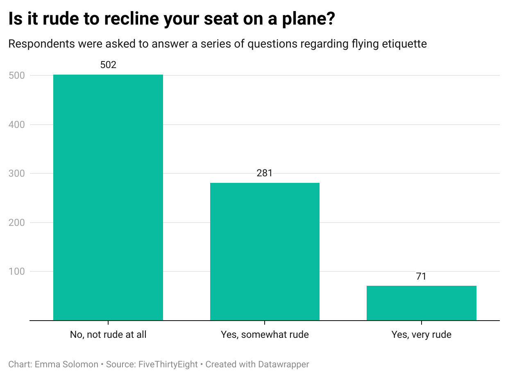

# Research on Flying Etiquette

### For this data set, researchers sought to gauge responses to questions regarding flying etiquette. 

The question that I found most interesting was: **Is it rude to recline your seat on a plane?** This is not a question I have given much thought to, as planes provide everyone with a reclining option. I never thought people would find it rude if it is utilized by passengers. Most of the other findings in the data set regarded questions like measuring the frequency of getting up to visit the lavatory or speaking to others around you. I find this question to be less controversial, which is why I was surprised by the mixed responses. 

### Below I have presented my findings on a chart

